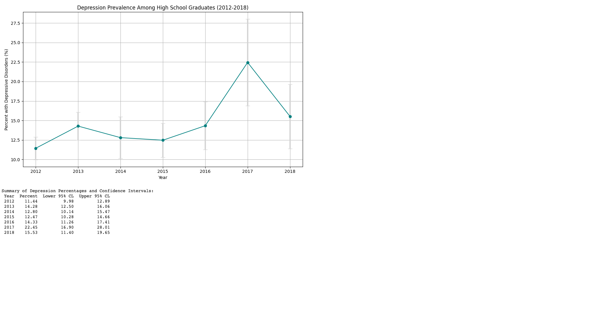

# Depression Prevalence Analysis Among Adults by Education Level

This project analyzes the prevalence of depressive disorders among U.S. adults from 2012 to 2018, specifically focusing on individuals whose highest level of education is **High School Graduate or GED Certificate**. The data is visualized and interpreted to uncover meaningful trends using Python and pandas.

---

## 📊 Project Objective
To explore and visualize how the prevalence of depression has changed over time among adults with a specific educational background, leveraging confidence intervals for statistical insights.

---

## 🔧 Tools Used
- Python 3
- pandas
- matplotlib

---

## 📁 Project Files
- `AdultDepressionAnalysis.ipynb`: Main Python script for analysis
- `depression_trend.png`: Output plot showing trend of depression prevalence with error bars
- `requirements.txt`: Dependencies to run the script

---

## 🚀 How to Run the Project
1. Clone the repository:
```bash
git clone https://github.com/your-username/adult-depression-education-analysis.git
cd adult-depression-education-analysis
```

2. Create and activate a virtual environment (optional but recommended):
```bash
python -m venv venv
source venv/bin/activate  # On Windows use `venv\Scripts\activate`
```

3. Install dependencies:
```bash
pip install -r requirements.txt
```

4. Run the script:
```bash
python depression_education_analysis.py
```

---

## 📈 Sample Output
The generated plot (`depression_trend.png`) shows:
- Percentage of adults with depressive disorders (2012–2018)
- Error bars reflecting 95% confidence intervals



---

## 📌 Key Insights
- Depression prevalence fluctuated between **11% and 22%** from 2012 to 2018.
- A significant spike is seen in **2017** (~22%), with a wider confidence interval indicating higher variability.
- Post-2017, prevalence remained higher than early years, warranting further investigation.

---

## 🧠 Future Improvements
- Compare across other education groups
- Create an interactive dashboard using Streamlit or Dash
- Add statistical significance tests (e.g., t-tests, ANOVA)

---

## 👨‍💻 Author
**Yamini**  
_Data Engineer | ETL Specialist | Data Enthusiast

---

Feel free to fork this project, contribute, or connect with me for collaboration!

